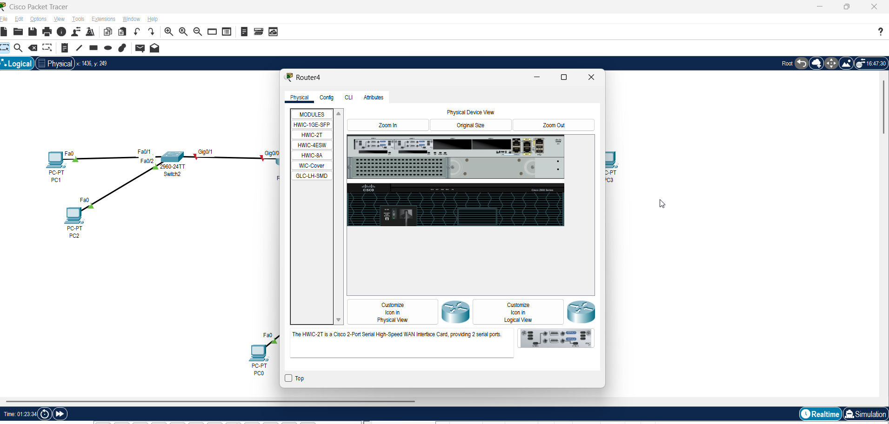
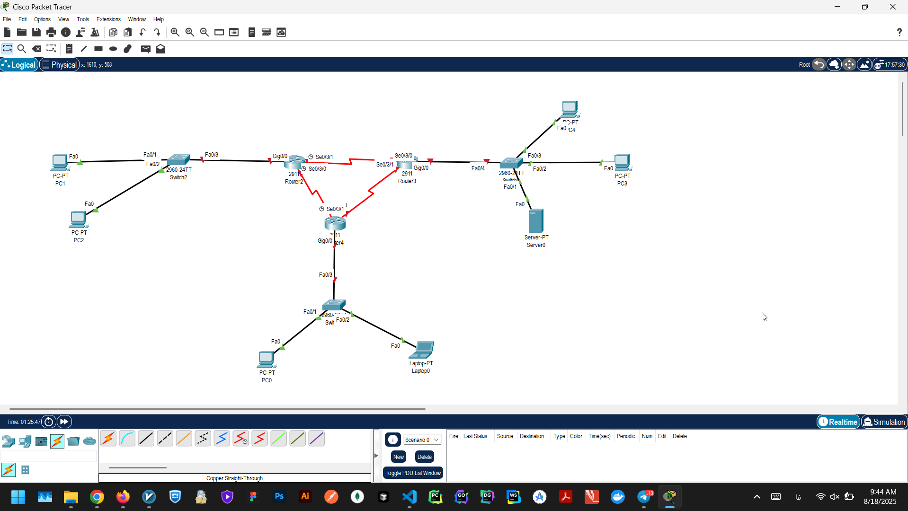
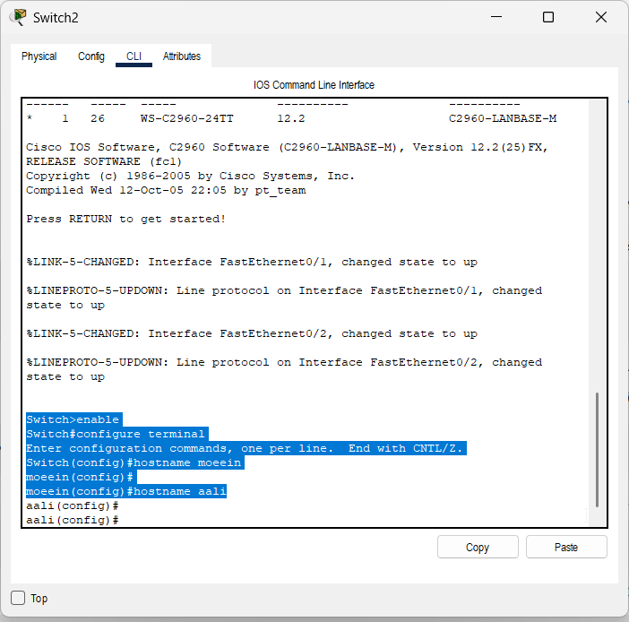
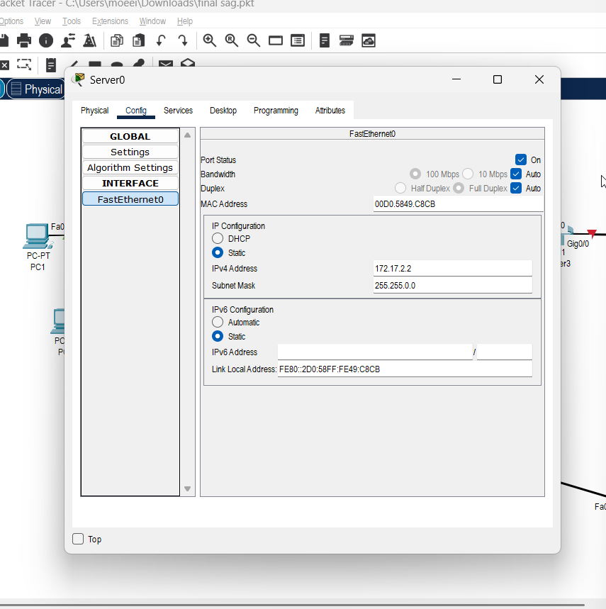
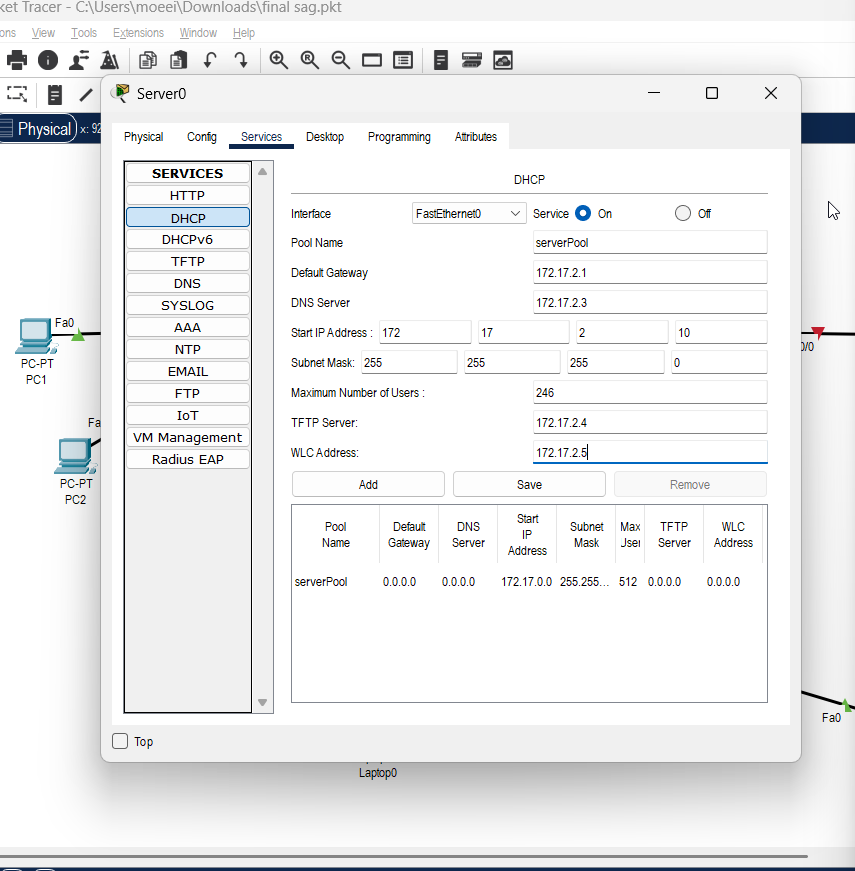
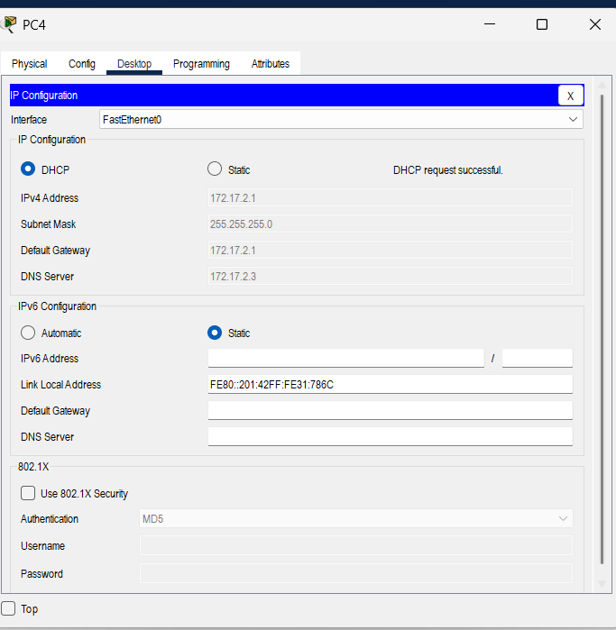
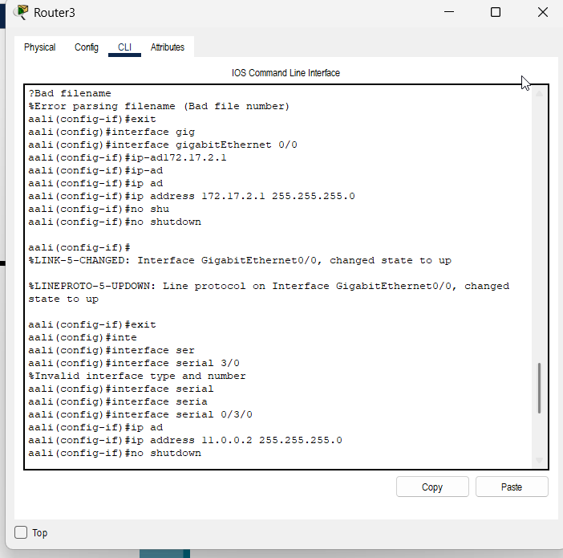
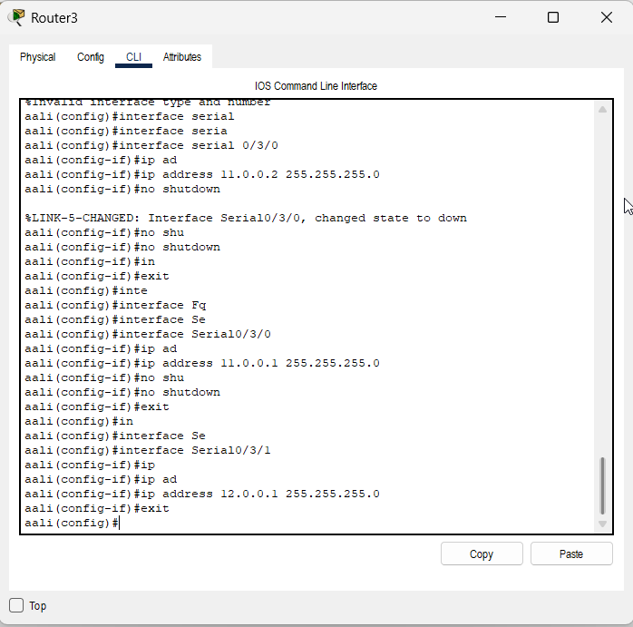
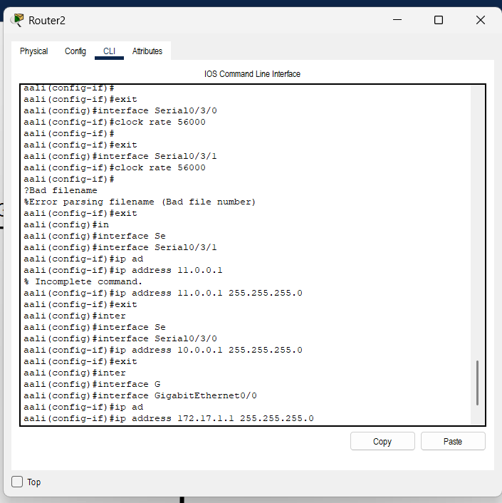
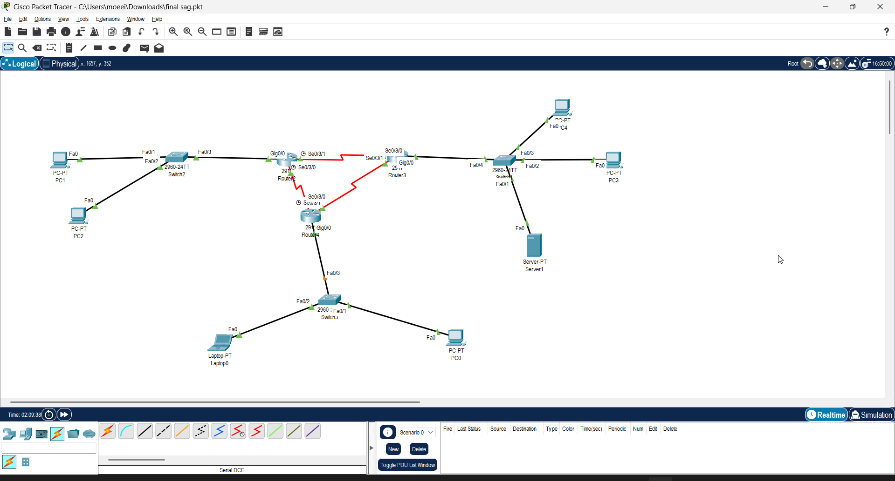

# آزمون پایان‌ترم درس آزماشگاه شبکه‌های کامپیوتری - تابستان ۱۴۰۴

ابتدا سناریو را به صورت مقابل پیاده‌سازی می‌کنیم:

حال اسم میزبان‌ها را تغییر می‌دهیم:

سپس به سرور آیپی می‌دهیم و pool را برای dhcp آن تنظیم می‌کنیم:

حال به pc ها می‌رویم برای آن‌ها آیپی می‌گیریم:

حال روتینگ بین روترها را انجام می‌دهیم مطابق آیپی‌های گفته شده داخل دستور کار:

می‌بینیم که روترها به درستی به هم متصل هستند:

سپس یک pool دیگر اضافه می‌کنیم برای باقی زیرشبکه‌ها و آن را سیو می‌کنیم:

حال به سراغ باقی سیستم‌ها می‌رویم و برای آن‌ها آیپی می‌گیریم:

حالا که همگی آیپی دارند پینگ می‌کنیم و نتیجه را می‌بینیم:

